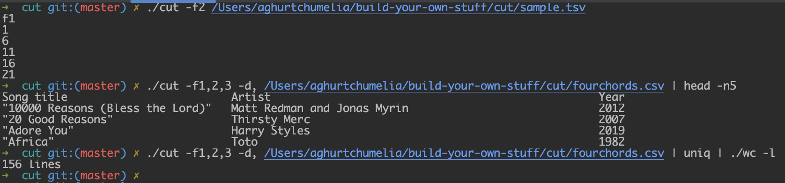

### Build your own cut

https://codingchallenges.substack.com/p/coding-challenge-4

Setting up and testing:
 
 - run: `cd ~`
 - clone the repo
 - run: `cd build-your-own-stuff/cut`

run the following commands for testing:
 - `./cut -f2 sample.tsv`
 - `./cut -f1,2,3 fourchords.csv`
 - `./cut -f1,2,3 -d, fourchords.csv | head -n5`
 - `./cut -f1,2 sample.tsv`
 - `./cut -f1,2,3 sample.tsv | uniq | ./wc -l`
 - `./cut -f1,2,3 -d, fourchords.csv | uniq | ./wc -l`

Example screenshot on my own machine:

