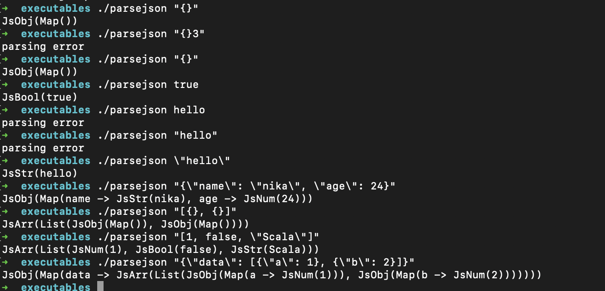

Build a JSON parser

https://codingchallenges.substack.com/p/coding-challenge-2

I used `scala.util.parsing.combinators` to parse raw JSON string to sealed `Js` hierarchy, please view: `json/Js.scala` 

Setting up and testing:
- cd to home: `cd ~`
- clone the repo
- run: `vim parsejson`
- paste the following three lines inside `parsejson`:

```
#!/bin/sh

cd ~/build-your-own-stuff/json-parser/target/scala-2.13/

scala json-parser.jar $1
```

save and exit (I hope you know to exit vim 😄)
run the following commands for testing:

- `./parsejson 1`
- `./parsejson "{}"`
- `./parsejson "[]"`
- `./parsejson "[{}, {}]"`
- `./parsejson "[1, false, \"Scala\"]"`
- `./parsejson true`
- `./parsejson \"hello\"`
- `./parsejson "{\"name\": \"nika\", \"age\": 24}"`
- `/parsejson "{\"data\": [{\"a\": 1}, {\"b\": 2}]}"`

Example screenshot on my own machine:


