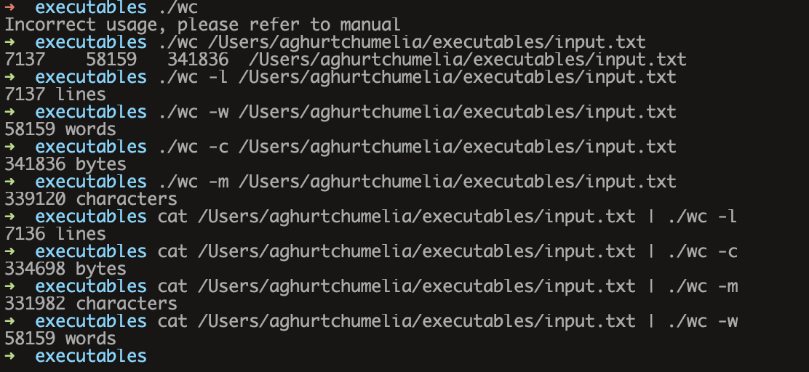

### Build your own word counter

https://codingchallenges.substack.com/p/coding-challenge-1

Setting up and testing:
 
 - cd to home: `cd ~`
 - clone the repo
 - run: `cd word-counter`
 - run: `sudo chmod 755 wc`

run the following commands for testing:
 - `./wc -c ~/input.txt`
 - `./wc -m ~/input.txt`
 - `./wc -w ~/input.txt`
 - `./wc -l ~/input.txt`
 - `./wc ~/input.txt`
 - `cat ${some_file_path} | ./wc -c`
 - `cat ${some_file_path} | ./wc -m`
 - `cat ${some_file_path} | ./wc -w`
 - `cat ${some_file_path} | ./wc -l`

Example screenshot on my own machine:

